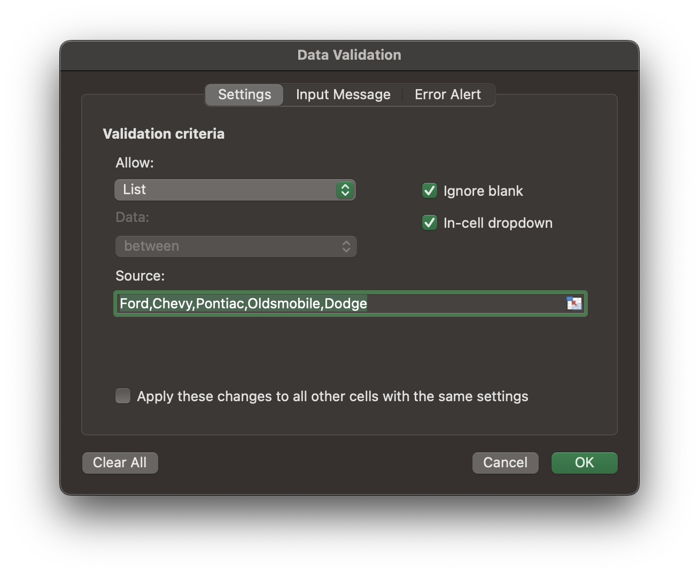

# DATA VALIDATION

Select cells to validate, then **Data &rarr; Data Validation**.

## Settings

Set up validation criteria. Validate that cell contains value from specified list, whole number, decimal, date, etc.

For list criterion, can type out source, or specify cell range.

## Error Alert

Customize alert of invalid value. Can relax validation rules and allow non-conforming values.
