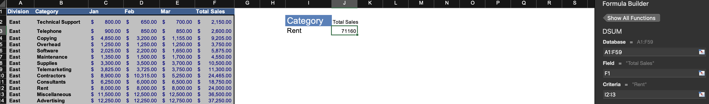
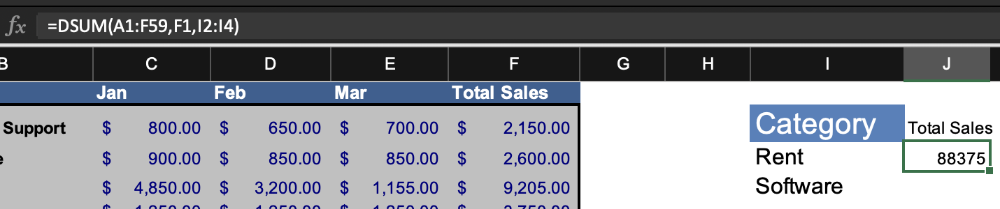
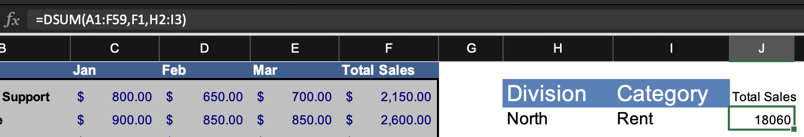

# `DSUM()`

Database sum. Sum with criteria.

Params:

* `database`: Select whole list, including headers.
* `field`: Header of column to sum.
* `criteria`: Header and value that must match what's in list for the sum.

## OR Criteria

Sum values that match one criterion or another. Add more values to criteria param.

## AND Criteria

Add another column header and value to criteria.

Can combine AND and OR by adding more rows to criteria columns and adjust `criteria` param.
