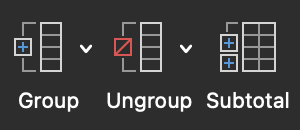
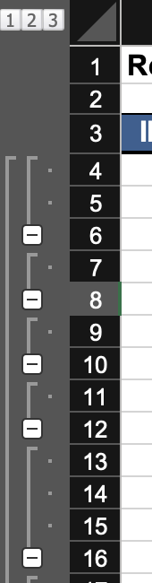

# LIST

First row expected to be column headers. Format it differently to help myself and Excel.

List expected to be contiguous. If empty row in middle, considered as two lists.

## Sort (Single Level)

Click anywhere in list. Go to **Data &rarr; Sort & Filter**. Can sort alphabetically.

## Sort (Multi-Level)

To sort by multiple columns, click anywhere in list, go to **Data &rarr; Sort & Filter &rarr; Custom Sort**. Opens custom sort window, can add new levels to sort.

## Sort (Custom)

When doing custom sort, can specify custom order list. Allows sorting by day of week or month of year instead of alphabetical.

To use own list, go to **Excel &rarr; Preferences &rarr; Custom Lists** to add.

## Filter

Click anywhere in list. Click **Filter**. Column headers have dropdowns to allow filtering.

Click **Clear** button next to **Filter** to clear all current filters.

## Subtotal

Sort to group relevant rows. Then click **Data &rarr; Subtotal**:

Can calculate subtotal per group. Also adds controls at left to collapse groups or only display subtotals.

To do **Subtotal** on table, first **Table &rarr; Convert to Range**.

## Format as Table

**Home &rarr; Format as Table**. Presents list as table for better visualization. New **Table** menu added to allow various options like adding "Total Row" (auto-updated when filtering). Drag lower right corner down to add more rows.

## Duplicates

### Highlight

Select column of unique values (**cmd + shift + &darr;** to select all from current cell to last row of value). **Home &rarr; Conditional Formatting &rarr; Highlight Cells Rules &rarr; Duplicate Values**.

### Remove

If formatted as table, **Table &rarr; Remove Duplicates**. Otherwise, **Data &rarr; Remove Duplicates**. Select which columns should be considered in identifying duplicates.
